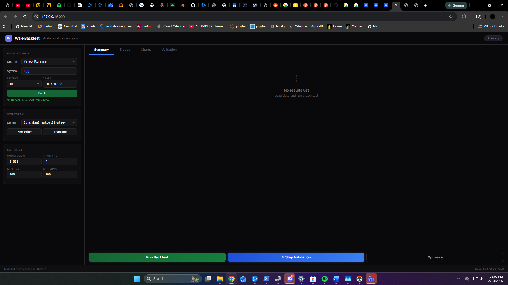

# Wale Backtest Engine

A local backtesting platform that translates PineScript strategies into Python code, runs them against real market data, and validates results with a 4-step statistical pipeline. Ships as both a Flask web app and a standalone Windows EXE.

[](https://www.python.org/downloads/)
[](https://creativecommons.org/licenses/by-nc-sa/4.0/)

---

## Screenshots

### Web Backtester (Flask)



The dashboard you get when you run the web app or click **Open Dashboard** from the launcher. Pick your data source and symbol in the left sidebar, choose a strategy (or paste PineScript and hit Translate), tweak commission and validation settings, then run the backtest. The right panel shows Summary (like in the shot above—trades, profit factor, win rate, drawdown), plus Trades, Charts, and Validation tabs. Everything stays local at `127.0.0.1:5000`.

### Standalone Engine (Windows EXE)


Double-click **WaleBacktest.exe** and you get this launcher: it starts the Flask server on port 5000 and gives you a single **Open Dashboard** button to jump straight into the web backtester. No Python or terminal required. When you’re done, **Stop & Quit** shuts the server and closes the app. Same engine under the hood whether you run from the EXE or from `python web_app.py`.

---

## What It Does

1. **Translates PineScript to Python.** Paste a TradingView strategy, hit Translate, and the engine parses indicators, conditions, and entries/exits into a working Python class.

2. **Runs backtests that match TradingView.** Signals are generated on bar close and filled at the next bar's open price, matching TV's default execution model. Entry and exit prices use actual open values, not close.

3. **Validates strategy robustness.** The 4-step pipeline runs in-sample optimization, permutation testing (Monte Carlo p-value), walk-forward out-of-sample testing, and walk-forward permutation testing. A strategy either passes or it doesn't.

4. **Lets you write strategies directly in Python.** The Python editor validates your code by actually running it against synthetic data before saving. If `generate_signals()` crashes, the file gets deleted and you get the error back.

---

## Quick Start

```bash
git clone https://github.com/WaleA-Dev/wale-pinescript-engine.git
cd wale-pinescript-engine
pip install -r requirements.txt

# Launch the web app
python web_app.py
# Opens http://127.0.0.1:5000 in your browser

# Or launch the desktop GUI
python app.py
```

### Build Standalone EXE

```bash
pip install pyinstaller
pyinstaller PineScriptBacktester.spec
# Run the launcher from dist (e.g. WaleBacktest.exe or PineScriptBacktester.exe)
./dist/WaleBacktest.exe
```

---

## How to Use the Web App

### 1. Load Data

Pick a source from the sidebar:

- **Yahoo Finance** - Type a ticker (QQQ, NVDA, BTC-USD), pick an interval (1H, 1D, 1W), click Fetch.
- **Dukascopy** - For forex tick data. Enter a pair (EUR-USD), date range, and resampling period.
- **CSV Upload** - Drop in any OHLCV CSV file.

### 2. Pick or Write a Strategy

The engine ships with 12 built-in strategies (Donchian, EMA Cross, MACD, RSI, NDX Trader, etc). Select one from the dropdown.

Or write your own:

**Pine Editor** - Paste PineScript, click Translate. The engine parses it, generates a Python file, and registers it in the dropdown.

**Python Editor** - Write a `BaseStrategy` subclass directly. The editor pre-fills a working SMA crossover template. Click Save & Register. The backend validates syntax, checks for a `BaseStrategy` subclass, imports the module, and test-runs `generate_signals()` on 100 bars of synthetic data. If anything fails, you get the error and the file is cleaned up.

### 3. Run Backtest

Click "Run Backtest". The Summary tab shows key metrics (Profit Factor, Sharpe, Win Rate, Max Drawdown, Total Return). The Trades tab lists every trade with entry/exit dates, prices, bars held, and P&L. The Charts tab draws equity curve and drawdown with axis labels, date ticks, and a hover crosshair.

### 4. Validate

Click "4-Step Validation" to run the full statistical pipeline:

| Step | What It Does |
|------|-------------|
| 1. In-Sample Optimization | Grid search for best parameters on training data |
| 2. IS Permutation Test | Shuffles returns 200+ times to get a Monte Carlo p-value |
| 3. Walk-Forward OOS | Tests optimized params on unseen data |
| 4. WF Permutation Test | Confirms OOS results aren't just luck |

Final verdict: **VALIDATED**, **OVERFIT**, or **POOR**.

### 5. Export

Every tab has an Export button:

- Summary tab: metrics as CSV
- Trades tab: full trade list as CSV (with dates, prices, bars held, P&L)
- Charts tab: equity curve and drawdown as CSV
- Validation tab: full results as JSON

---

## Execution Model

The engine matches TradingView's default fill behavior:

| Event | Evaluated | Filled |
|-------|-----------|--------|
| Entry signal | Bar N close | Bar N+1 open |
| Exit signal | Bar N close | Bar N+1 open |

On bars where position changes, the return is calculated from open to close (since the fill happened at open). On bars where position is held, the return is close-to-close. Commission is deducted on every position change.

Trade entry and exit prices in the trade list are the actual open prices where fills occurred, not close prices.

---

## Pine Translator

The translator handles these Pine functions:

| Pine Function | Python Output |
|--------------|--------------|
| `ta.ema(src, len)` | `src.ewm(span=len, adjust=False).mean()` |
| `ta.sma(src, len)` | `src.rolling(len).mean()` |
| `ta.rma(src, len)` | `src.ewm(alpha=1/len, adjust=False).mean()` |
| `ta.rsi(src, len)` | Wilder's RMA on gain/loss (matches TV exactly) |
| `ta.atr(len)` | RMA on true range |
| `ta.macd(src, fast, slow, sig)` | EMA difference with custom parameters |
| `ta.crossover(a, b)` | `(a > b) & (a.shift(1) <= b.shift(1))` |
| `ta.crossunder(a, b)` | `(a < b) & (a.shift(1) >= b.shift(1))` |
| `ta.highest(src, len)` | `src.rolling(len).max()` |
| `ta.lowest(src, len)` | `src.rolling(len).min()` |

The translator also extracts `input.int()`, `input.float()`, `input.bool()` declarations and generates a parameter grid for optimization.

Not supported yet: `ta.adx`, `ta.stoch`, `ta.bb`, `request.*`, `array.*`, ternary expressions.

---

## Project Structure

```
wale-pinescript-engine/
  web_app.py                  Flask backend (web UI entry point)
  app.py                      Desktop GUI entry point
  backtest_engine.py          CLI entry point
  templates/
    converge.html             Web UI (single-page dashboard)
  src/
    bar_returns.py            Bar-level return computation with next-bar-open fills
    data_loader.py            Yahoo, Dukascopy, CSV loading
    optimization.py           Grid search
    permutation.py            Monte Carlo permutation engine
    strategies/
      base.py                 BaseStrategy ABC with indicator helpers
      donchian.py             Donchian breakout
      ema_crossover.py        EMA crossover
      ndx_trader.py           NDX trend + RSI pullback
      ...                     12 strategies total
    pine_translator/
      parser.py               PineScript AST extraction
      translator.py           Pine to Python code generation
      pipeline.py             End-to-end translate + save + register
      validator.py            Syntax and structure validation
    validation/
      full_validation.py      4-step validation pipeline
      in_sample_permutation.py
      walk_forward.py
  tests/                      58 unit tests
  data/
    cache/                    Downloaded data cache
    uploads/                  CSV uploads
  docs/
    screenshots/
  gui/
    main_window.py            PySide6 desktop application
  data_providers/
    databento_provider.py     Databento API integration
```

---

## Writing a Python Strategy

Every strategy inherits from `BaseStrategy` and implements `generate_signals()`:

```python
import numpy as np
import pandas as pd
from src.strategies.base import BaseStrategy

class MyStrategy(BaseStrategy):
    def __init__(self, **params):
        super().__init__(**params)
        self.params.setdefault('fast', 10)
        self.params.setdefault('slow', 30)

    def generate_signals(self, df):
        fast = df['close'].rolling(self.params['fast']).mean()
        slow = df['close'].rolling(self.params['slow']).mean()
        signal = pd.Series(0, index=df.index)
        signal[fast > slow] = 1
        signal[fast < slow] = -1
        return signal

    def param_grid(self):
        return {'fast': [5, 10, 20], 'slow': [20, 30, 50]}
```

Signal values: `1` = long, `-1` = short, `0` = flat.

The `param_grid()` method is optional but needed for optimization and validation.

---

## Indicator Helpers

`BaseStrategy` includes these static methods so you don't have to rewrite them:

```python
self.calc_ema(series, span)      # Exponential moving average
self.calc_sma(series, window)    # Simple moving average
self.calc_rsi(series, period)    # RSI with Wilder's RMA (alpha=1/period)
self.calc_atr(df, period)        # Average true range using RMA
self.calc_macd(series, fast, slow, signal)  # Returns (macd, signal_line, histogram)
self.crossover(a, b)             # True when a crosses above b
self.crossunder(a, b)            # True when a crosses below b
```

---

## Running Tests

```bash
python -m pytest tests/ -v

# 58 tests covering bar_returns, strategies, translator,
# parser, permutation, walk-forward, data loader, validation
```

---

## Data Sources

### Yahoo Finance
Type any ticker Yahoo supports. Daily data goes back decades. Hourly data is limited to the last 730 days by Yahoo's API.

### Dukascopy
Forex tick data from Dukascopy's free archive. Specify a date range and resampling period (1min to 1D). Requires `duka-dl` package (`pip install duka-dl`).

### CSV Upload
Any CSV with `open`, `high`, `low`, `close` columns. The first column should be a timestamp. Volume is optional.

---

## Requirements

- Python 3.10+
- Windows 10/11 (for EXE builds)
- Dependencies: Flask, pandas, numpy, scipy, matplotlib

Optional:
- PySide6 (for desktop GUI)
- Databento API key (for live data in desktop app)
- duka-dl (for Dukascopy forex data)

---

## License

CC BY-NC-SA 4.0. Free to use and modify for personal and research purposes. Not for commercial use or resale. If you build on it, share your work under the same license. No warranty.

---

## Related Projects

- [Wale Monte Carlo Engine](https://github.com/WaleA-Dev/wale-montecarlo-engine) - Stress test validated trades with 200K+ simulations
